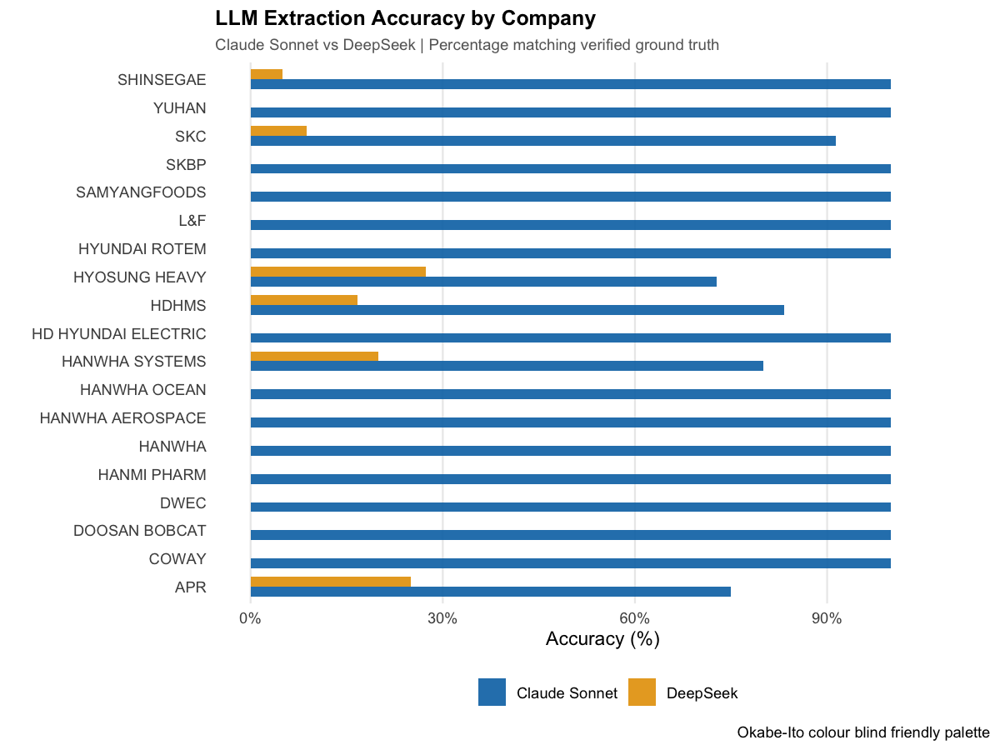
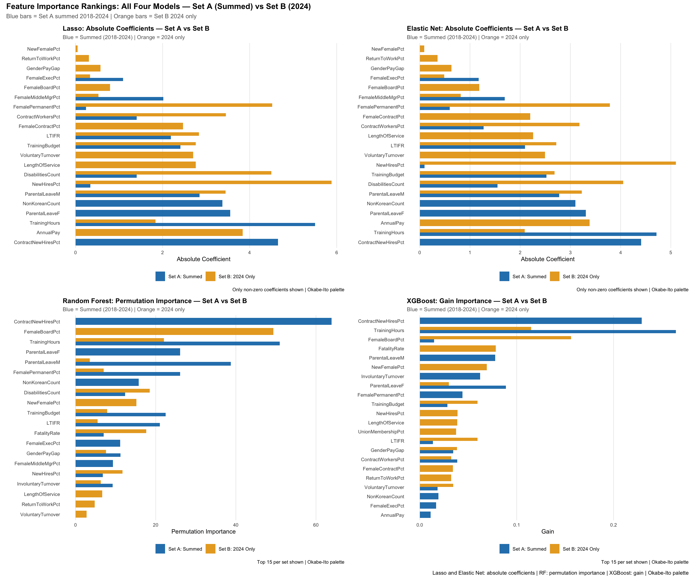
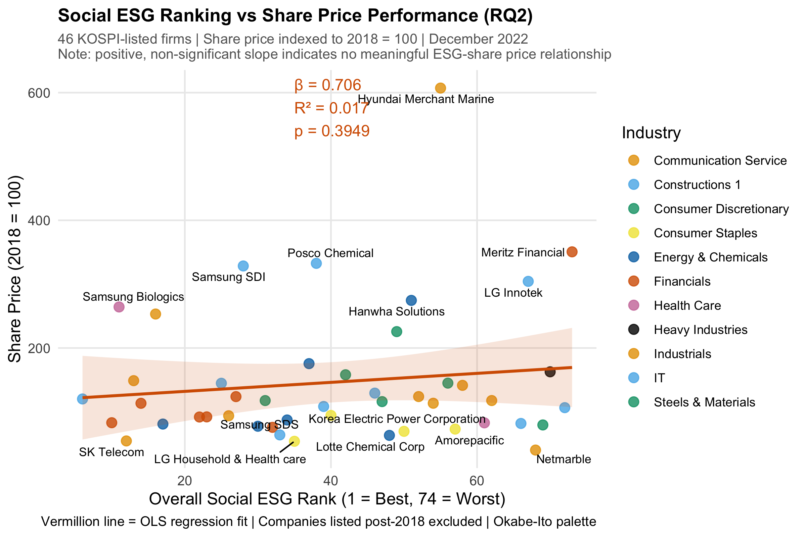
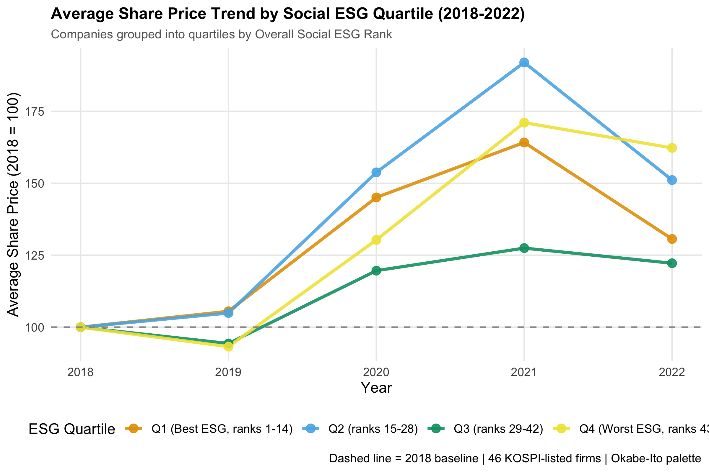

# Predicting Social ESG Standing in KOSPI-Listed Korean Firms: ML + LLM-Assisted Data Extraction

MSc Data Science dissertation (University of Sheffield). Extends a 55-firm Korean employment-ESG database to 74 firms using LLM-assisted extraction from company disclosures, formally compares two LLMs' extraction accuracy against verified ground truth, then uses four ML models to identify which employment indicators most robustly predict a firm's composite Social ESG rank, and tests whether that rank relates to share price.

> **Reproducibility note:** the LLM extraction accuracy analysis (`extraction_log.xlsx`, included) is fully runnable as-is. The ML modelling pipeline (RQ1/RQ2) is not runnable from this repo alone; it needs two source data files that aren't redistributed here for licensing reasons (see Data, below). The code and verified results are still fully readable and auditable; you just can't `git clone` and rerun the whole thing end-to-end.

## Key results

**LLM extraction accuracy (Claude Sonnet 5 vs DeepSeek-R1), independently reproduced from the raw extraction log:**

| Metric (vs. verified ground truth) | Claude Sonnet 5 | DeepSeek-R1 |
|---|---|---|
| Exact-match rate | **95.8%** | 4.5% |
| MAE | 0.796 | 2,631,446* |
| Inter-model ICC (consistency) | 0.0164 (95% CI [−0.09, 0.12]); essentially no agreement | |

\* DeepSeek's MAE is inflated by the KRW-denominated Annual Pay indicator, not representative of its typical error size.



Claude reproduced 100% of values correctly for 14 of the 19 newly-extracted companies; the other 5 accounted for all of its non-perfect scores. DeepSeek's errors didn't cluster into one fixable pattern: 73% of classified errors were unidentified/inconsistent rather than a single systematic misunderstanding.

**RQ1: predicting composite Social ESG rank (LOOCV RMSE/R² for Lasso, Elastic Net, XGBoost; OOB RMSE/R² for Random Forest):**

| Model | Set A (2018–2024 summed) | Set B (2024 only) |
|---|---|---|
| Lasso | RMSE 14.336, R² 0.497 | RMSE 21.297, R² **−0.066** |
| Elastic Net | RMSE 14.145, R² 0.509 | RMSE 21.199, R² **−0.042** |
| Random Forest | RMSE 14.160, R² 0.566 | RMSE 19.441, R² 0.183 |
| XGBoost | **RMSE 13.306, R² 0.612** | RMSE 18.894, R² 0.218 |

XGBoost is the best-performing model on the primary (Set A) specification. The two regularised linear models collapse to negative R² on the single-year Set B data (worse than a mean-prediction baseline) while the tree-based models degrade more gracefully, attributable to Set B's larger, more unevenly distributed missingness rather than an underlying distributional problem in the predictors themselves.

Seven indicators were selected/highly-ranked by **all four** Set A models: `TrainingHours`, `ContractNewHiresPct`, `ParentalLeaveF`, `NonKoreanCount`, `ParentalLeaveM`, `TrainingBudget`, `FemalePermanentPct`. Three more (`LTIFR`, `ContractWorkersPct`, `DisabilitiesCount`) were robust across exactly 3 of 4.



**RQ2: does Social ESG rank relate to share price?**

No. OLS regression of December 2022 share price on `OverallRank` (N = 46): β = 0.706, R² = 0.017, p = .395; not statistically significant, and the relationship isn't even monotonic when firms are grouped into ESG quartiles (the 2nd-best quartile shows the highest 2021 share-price growth, not the best quartile).





## Methods & tools

- **Language:** R 4.5.1
- **LLM extraction accuracy:** exact-match rate, MAE (with/without a KRW-scale outlier indicator), close-match rate, intraclass correlation (`irr` package, two-way consistency ICC)
- **RQ1 modelling:** Lasso & Elastic Net (`glmnet`, LOOCV lambda selection), Random Forest (`ranger`, permutation importance, OOB error), XGBoost (`xgboost`, CV-tuned hyperparameters + manual LOOCV evaluation)
- **RQ2:** OLS regression with HC3 robust SEs, Breusch-Pagan and Shapiro-Wilk diagnostics, Cook's distance
- Full package list and roles: see `README_esg_project_code.md`

## Repo structure

```
esg-social-indicators-ml/
├── README.md                                  ← you are here
├── esg_project_code.R                          ← full analysis pipeline
├── README_esg_project_code.md                  ← detailed code-level README (sections, packages, outputs)
├── sanity_check_for_extraction_log.R           ← sensitivity check on the 5% reconciliation threshold
├── README_sanity_check_for_extraction_log.md   ← code-level README for the sensitivity check
├── extraction_log.xlsx                         ← Claude/DeepSeek extraction comparison log used by both scripts
└── figures/
    ├── stage1_accuracy_by_company.png
    ├── feature_importance_comparison.png
    ├── rq2_esg_vs_shareprice.png
    └── rq2_quartile_trend.png
```

## How to run

1. Install R 4.5.1+ and the packages listed in `README_esg_project_code.md`.
2. `esg_project_code.R` expects `final dataset.csv`, `share_price.csv`, and `extraction_log.xlsx` in the working directory. **The two raw data CSVs are not included in this repo** (see Data note below); you'll need the original dataset to reproduce the full pipeline end to end. `extraction_log.xlsx` is included, so the Stage 1 LLM extraction accuracy section and `sanity_check_for_extraction_log.R` can both be run standalone.
3. Run top to bottom; `set.seed(123)` is used throughout for reproducibility.

## Data

- The consolidated employment-indicator dataset (`final dataset.csv`) and share price data (`share_price.csv`) extend the Sheffield ESG Employment Database and are not redistributed here due to database licensing: the underlying employment indicators are collected from individual company sustainability/ESG disclosures.
- `extraction_log.xlsx` (included) contains only the derived Claude-vs-DeepSeek extraction comparison, not the raw source disclosures.

## Limitations

- RQ2's null result is based on N = 46 (a near-census rather than a probability sample), so the wide confidence interval is consistent with a true relationship anywhere from weakly negative to small positive; this is a data-driven inconclusiveness, not strong evidence of "no relationship."
- Two of the four RQ1 models (Lasso, Elastic Net) fail outright on the single-year Set B specification; the year-summed Set A specification is the primary, more reliable result.
- The RQ1 model performance table (Set A/B RMSE and R²) is reported as it appears in the dissertation and is structurally consistent with how the script computes it (LOOCV via `cv.glmnet` for Lasso/EN, OOB for Random Forest, a manual LOOCV loop for XGBoost), but since the raw dataset isn't bundled here, these specific figures weren't independently re-run from scratch the way the Stage 1 LLM accuracy numbers were (see Verification note below).
- One minor inconsistency worth flagging: a code comment in `esg_project_code.R` prints "ICC = 0.0163" while the actual computed value (and the value reported in the dissertation) is 0.0164, a trivial rounding-level discrepancy rather than a substantive error, but noted for transparency.

## Verification note

The Stage 1 LLM extraction accuracy numbers above (95.8%, 4.5%, MAE 0.796 / 2,631,446, ICC 0.0164) were independently recomputed directly from `extraction_log.xlsx` rather than taken from the dissertation text, and matched exactly. The RQ2 regression coefficients and the "quartile reversal" pattern were cross-checked against the corresponding figures in the dissertation and matched. This followed from a lesson learned on an earlier repo in this portfolio, where a result had been misattributed between two similarly-named model variants (see the other repos in this portfolio for that story).
